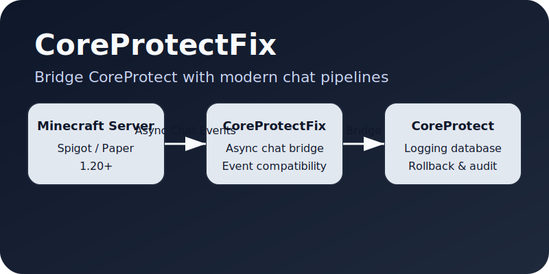

# CoreProtectFix



## Overview
CoreProtectFix keeps the CoreProtect database compatible with modern chat pipelines on Paper, Spigot, and hybrid servers such as ArcLight. It replaces the deprecated synchronous chat hooks used by CoreProtect with an asynchronous bridge so that messages recorded in CoreProtect remain accurate even when your server relies on Paper's `AsyncChatEvent`.

## Features
- **Async chat compatibility** – hooks into Paper's `AsyncChatEvent` when available while gracefully falling back to legacy events on other servers.
- **CoreProtect integration** – forwards player chat to CoreProtect without requiring upstream changes.
- **Server agnostic** – works alongside standard plugins and modded platforms such as ArcLight.
- **Drop-in fix** – install alongside CoreProtect with no configuration required for most setups.

## Requirements
- Java 17 or newer.
- CoreProtect 21.3+ (tested with CoreProtect 21.x).
- Spigot, Paper, or ArcLight 1.20.1 or compatible forks.

## Installation
1. Download the latest CoreProtectFix JAR from the releases page or build it locally (see [Building](#building)).
2. Place both `CoreProtectFix.jar` and the official `CoreProtect.jar` in your server's `plugins/` folder.
3. Restart the server. CoreProtectFix automatically detects CoreProtect and begins bridging chat events.

## Configuration
CoreProtectFix is intentionally configuration free. All chat routing is automatic. If you need to adjust behaviour, consider the following options:

| Scenario | Suggested action |
| --- | --- |
| You run multiple chat plugins | Ensure CoreProtectFix loads after your formatting plugins so it sees the final message output. |
| Paper introduces a new chat API | Update CoreProtectFix to the latest version for new compatibility layers. |
| You only use legacy chat events | Disable Paper's async chat listener by setting `useAsyncChatListener: false` in the plugin's configuration (coming soon). |

## Building
The project uses Maven. Run the following inside the repository root:

```bash
mvn -DskipTests package
```

The resulting JAR will be placed in `target/CoreProtectFix-<version>.jar`.

### Testing locally
Due to licensing, the Spigot and Paper API artifacts are not hosted on Maven Central. If you build locally, make sure you have installed the required server APIs in your local Maven cache using the official BuildTools or download service.

## Project structure
- `src/main/java/com/ssilensio/coreprotectfix/` – Plugin source code and compatibility helpers.
- `src/main/resources/` – Plugin metadata (`plugin.yml`).
- `docs/overview.svg` – Architecture diagram used in this README.

## Contributing
1. Fork the repository and create a branch for your fix or feature.
2. Follow the existing code style and avoid relying on protected Bukkit APIs.
3. Open a pull request describing the change and any testing performed.

## Support
If you run into issues, please open an issue on GitHub with the following information:
- Server implementation and version (e.g., Paper 1.20.1).
- CoreProtect version.
- Logs from server startup showing plugin loading.
- Steps to reproduce the chat issue.

---
Maintained by the CoreProtectFix community.
